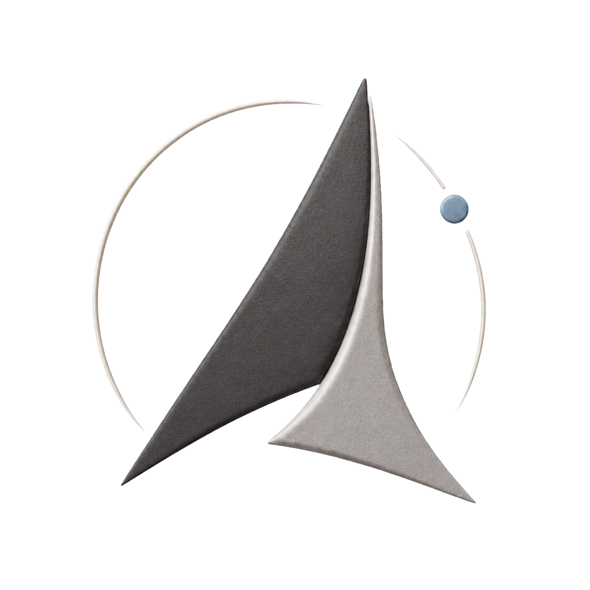
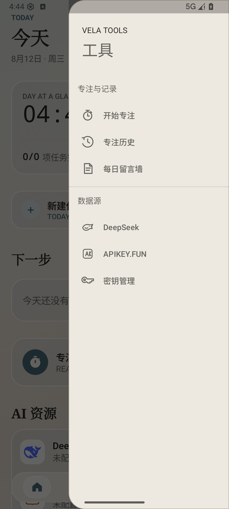
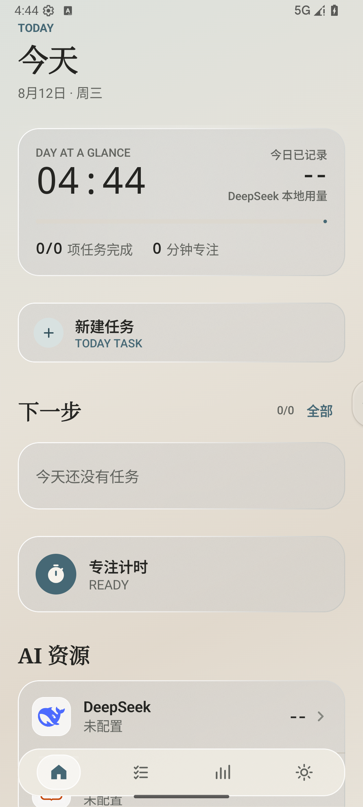
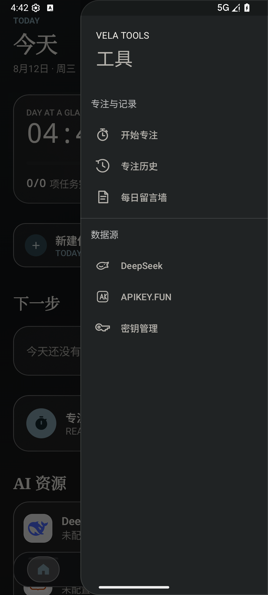
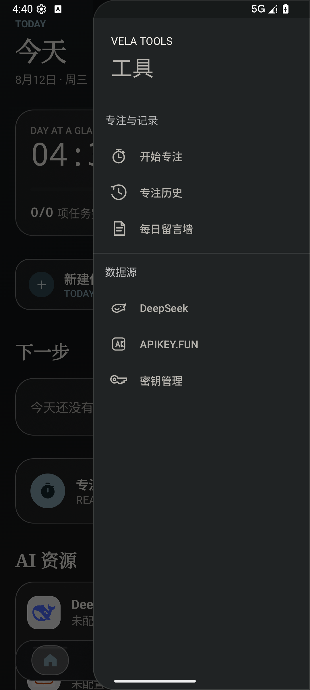

<p align="center">
  
</p>

<h1 align="center">Vela AI Workbench</h1>

<p align="center">
  A calm, local-first Android workbench for tasks, focus, daily reflection,<br />
  AI account insights, and a compact home-screen widget.
</p>

<p align="center">
  <a href="https://github.com/c1216149718-dev/Vela-AI-Workbench/releases/latest"></a>
  
  
  
</p>

> Vela is currently Chinese-first. The source is public for inspection and collaboration, but no open-source license has been granted yet. See [License](#license).



## What Vela does

- Organizes tasks with inbox/today/scheduled flows, search, priorities, reminders, and estimated duration.
- Runs immersive 5–300 minute focus sessions with pause-aware history and selectable 3D celestial themes.
- Stores a private daily reflection wall on the device.
- Reads DeepSeek balance snapshots and estimates spend from balance deltas.
- Aggregates APIKEY.FUN usage across multiple keys by date, model, requests, tokens, and currency.
- Keeps CNY and USD separate instead of presenting a misleading combined total.
- Provides a resizable `3 × 2` RemoteViews widget for DeepSeek and APIKEY.FUN account status.
- Supports light/dark themes, reduced-motion behavior, and phone/tablet navigation layouts.

## Screens and interaction

Vela uses a four-destination workbench—Home, Tasks, Insights, and Settings—plus a right-edge tool handle for focus, history, reflections, provider pages, and key management. The v1.20.0 handle sleeps mostly off-screen, wakes on touch, and opens by tap or left drag.

| Sleeping handle | Drag interaction | Dark tools panel |
| --- | --- | --- |
|  |  |  |

## Data accuracy and privacy

Vela does not operate a backend. Tasks, focus sessions, reflections, cached usage, and account configuration remain on the Android device.

- DeepSeek's documented balance endpoint does not provide request, token, or model history. Vela therefore shows the official balance and labels spend derived from adjacent balance snapshots as an estimate.
- APIKEY.FUN usage is fetched from the profiles you configure. Up to three enabled keys are queried concurrently; partial failures keep the last successful cache.
- Credentials are never committed to this repository, Room, screenshots, or logs.
- In v1.20.0, API keys are stored in private app Preferences DataStore. Hardware-backed encrypted storage is planned before a production-signed distribution.

Do not report estimated DeepSeek spend as official historical usage, and do not combine amounts in different currencies.

## Download

The first public release is [v1.20.0](https://github.com/c1216149718-dev/Vela-AI-Workbench/releases/tag/v1.20.0).

The attached APK is a development build signed with the standard Android debug certificate. It is provided for evaluation only—not as a Play Store or production release. Verify its SHA-256 before installing:

```text
E32AA68A8E1F426C11525FDFC1E2FEB80CC08679B6E28AE7E9387DAAD0AC3697
```

Android may warn about sideloading. Existing installations with the same application ID and compatible signature can be upgraded without clearing local data.

## Build from source

Requirements:

- Android Studio with Android SDK 36
- JDK 17
- Git

Clone and create the local SDK pointer:

```powershell
git clone https://github.com/c1216149718-dev/Vela-AI-Workbench.git
Set-Location Vela-AI-Workbench
$sdkPath = "$env:LOCALAPPDATA\Android\Sdk".Replace('\', '\\').Replace(':', '\:')
"sdk.dir=$sdkPath" | Set-Content local.properties
```

Build and run the JVM checks:

```powershell
./gradlew.bat :app:testDebugUnitTest :app:lintDebug :app:assembleDebug --console=plain
```

With an Android emulator or device connected, run the migration and UI journeys:

```powershell
./gradlew.bat :app:assembleDebugAndroidTest :app:connectedDebugAndroidTest --console=plain
```

The debug APK is generated at `app/build/outputs/apk/debug/app-debug.apk`.

## Verified v1.20.0 baseline

- 54/54 JVM tests passed.
- 23/23 connected tests passed on an Android 16 `medium_phone` emulator.
- Android Lint completed with zero errors.
- APK metadata: `com.deepseek.widget`, version code `25`, minimum SDK `26`, target SDK `36`.
- APK contains a v2-valid Android debug signature.
- Light, dark, reduced-motion, click, drag, close, and six-destination tool-panel journeys were visually checked.

These results do not replace real-account verification or testing on manufacturer devices. See [Known limitations](#known-limitations).

Every push and pull request to `main` also runs the JVM tests, Android Lint, and debug build through GitHub Actions.

## Architecture

Vela is a single-module Kotlin Android application. It combines Jetpack Compose feature screens with a Fragment `NavHost` for migration-compatible secondary navigation.

```text
UI (Compose + Fragment shell + RemoteViews widget)
                    │
             ViewModels / Workers
                    │
      Repositories and provider adapters
              ┌─────┴─────┐
        Room + DataStore   HTTPS APIs
```

Key technologies include Material 3, Room, DataStore, WorkManager, OkHttp, Vico charts, Haze/BlurView glass effects, and SceneView/Filament 3D rendering. Start with [`docs/HANDOFF.md`](docs/HANDOFF.md) for the verified current state and [`docs/PRODUCTIVITY_WORKBENCH_IMPLEMENTATION_PLAN.md`](docs/PRODUCTIVITY_WORKBENCH_IMPLEMENTATION_PLAN.md) for the product and architecture decisions.

## Known limitations

- Real DeepSeek/APIKEY.FUN credentials are not included; multi-key values still need field-by-field comparison against provider dashboards.
- API keys are not yet protected by Android Keystore-backed encryption.
- WorkManager reminders are inexact and can be delayed by Doze or manufacturer background restrictions.
- The latest acceptance run used a Pixel-style Android 16 emulator; manufacturer devices, landscape, three-button navigation, and a second launcher need broader validation.
- Account detail screens still use part of the Fragment/XML compatibility shell.
- The downloadable v1.20.0 artifact is debug-signed.

## Contributing and security

Issues and focused pull requests are welcome. Before submitting a change, run the JVM tests, Lint, debug build, and—when UI, Room, WorkManager, widget, or navigation behavior changes—the connected test suite.

Please do not open public issues containing API keys, account balances, provider responses, screenshots with personal data, or other secrets. Report sensitive findings privately through the repository owner's GitHub profile until a dedicated security policy/contact is published.

## Credits

Vela uses NASA and ESA celestial assets for its focus scenes. Exact sources and credits are recorded in [`app/src/main/assets/models/ATTRIBUTION.txt`](app/src/main/assets/models/ATTRIBUTION.txt). Product names and logos such as DeepSeek and APIKEY.FUN remain the property of their respective owners; this project is not endorsed by either provider.

## License

Copyright © 2026 Vela AI Workbench contributors. No open-source license has been granted for this repository yet. The source is publicly viewable, but copying, modifying, or redistributing it requires permission from the copyright holder except where applicable law permits.

Third-party dependencies and bundled assets remain subject to their respective licenses and terms.
